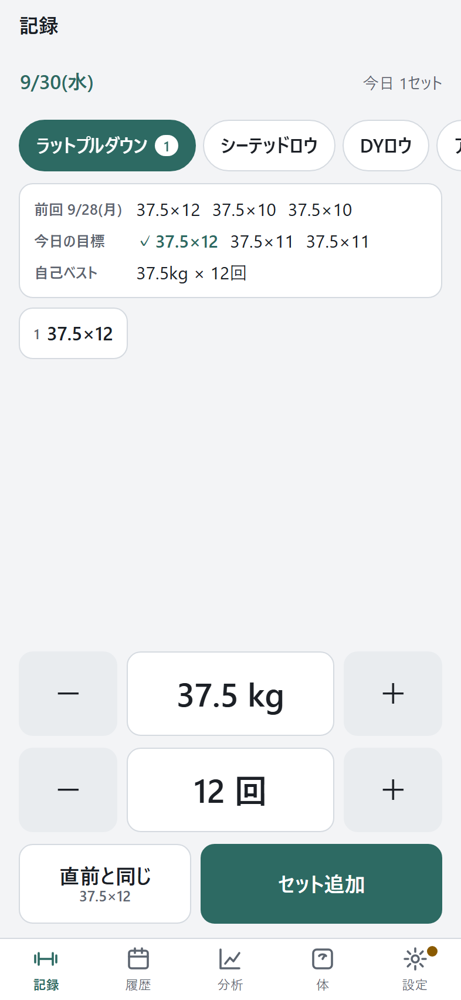
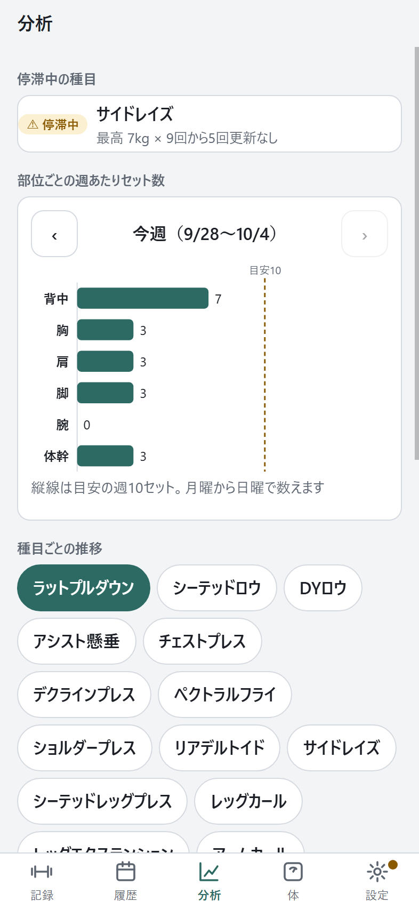
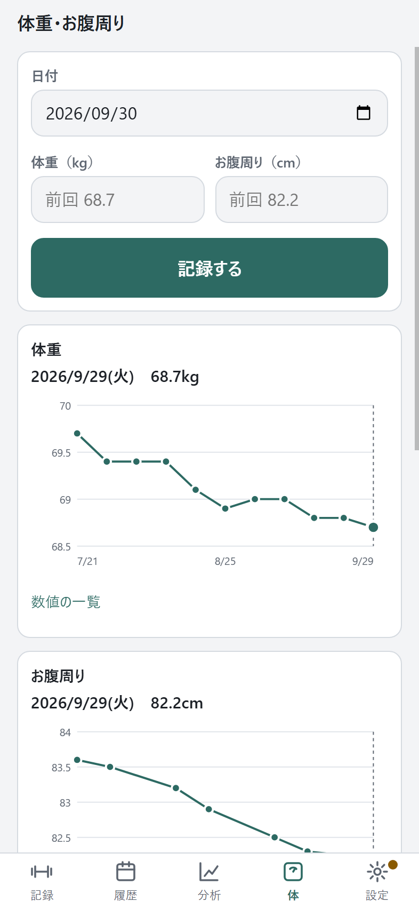
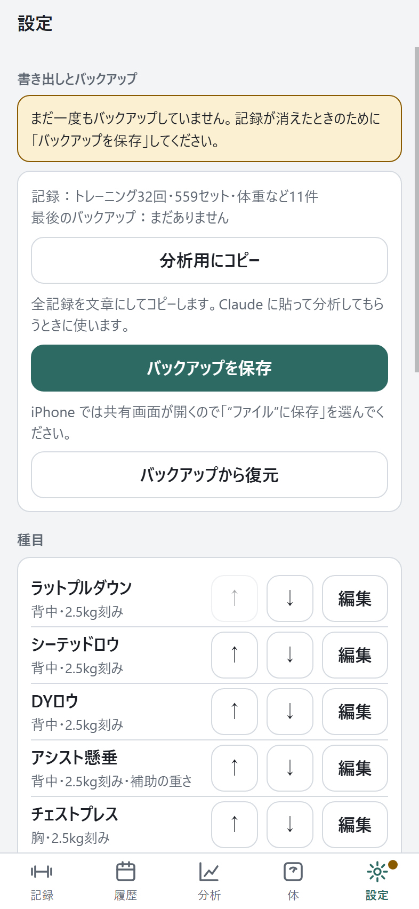

# 筋トレ記録（workout-log）

ジムで iPhone から重さと回数を片手ですばやく記録し、前回の記録と今日の目標を見ながら少しずつ重量を伸ばすための Web アプリです。
ホーム画面に追加すると通常のアプリのように全画面で起動し、電波がなくても動きます。

**公開先：** https://shunsuke-nmr.github.io/workout-log/

| 記録 | 分析 | 体重・お腹周り | 設定 |
|---|---|---|---|
|  |  |  |  |

> スクリーンショットは開発用の架空データで作成しています。画像は `docs/screenshots/` にあります。

## なぜ作ったか

筋力を伸ばすには「前回より少しだけ重く、または多く」を積み重ねることが大切です。ところが、トレーニング中に前回の記録を探したり、メモアプリに文字を打ったりするのは手間がかかり、続きません。

そこで次のことを目標にしました。

- **トレーニングの合間に数秒で記録できる**：種目はボタンで選び、重さと回数は大きな＋−ボタンで入力する。文字は打たない
- **次に何をすればよいかが分かる**：前回の全セット・自己ベスト・今日の目標を入力画面に常に表示する
- **記録を自分の手元だけに置く**：体重などの身体情報も扱うため、サーバーには一切送らない

## 機能

### トレーニングの記録
- 「今日のトレーニング開始」で日付つきの記録を作成（日付は後から修正可）
- 種目はボタンで選択。重さと回数は＋−ボタン（長押しで連続変更）。重さの刻みは種目ごとに設定
- 「セット追加」と、直前と同じ内容をワンタップで追加する「直前と同じ」
- 記録したセットはその場で修正・削除
- 入力画面に **前回の全セット・自己ベスト・今日の目標** を常に表示
- **目標の提案**：前回の全セットで12回できていたら重さを一段階上げて8回、そうでなければ各セット前回より1回多く
- 記録画面はスクロールなしの1画面で完結し、よく押すボタンは親指の届く画面下半分に配置

### 種目の管理
- 初期種目（16種目。重さの刻みの初期値はダンベルの種目が1kg、それ以外は2.5kg）

  | 部位 | 種目 |
  |---|---|
  | 背中 | ラットプルダウン、シーテッドロウ、DYロウ、アシスト懸垂 |
  | 胸 | チェストプレス、デクラインプレス、ペクトラルフライ |
  | 肩 | ショルダープレス、リアデルトイド、サイドレイズ |
  | 脚 | シーテッドレッグプレス、レッグカール、レッグエクステンション |
  | 腕 | アームカール、トライセプスプレスダウン |
  | 体幹 | アブドミナルクランチ |

- 追加・名前変更・並び替え・非表示、部位（背中・胸・肩・脚・腕・体幹）の分類、重さの刻みの変更
- **補助の重さを入れる種目**（アシスト懸垂など）：補助が軽いほど良い記録として扱います。画面に「補助」と表示し、自己ベスト・目標提案（全セット12回できたら補助を一段階減らす）・停滞判定・グラフもその向きで計算します。自分で追加した種目にも設定できます

### 履歴と分析
- 日付ごとの履歴一覧と詳細（修正・削除可）
- 種目ごとのグラフ：最大重量の推移、総負荷量（重さ×回数の合計）の推移。補助の種目は、補助の重さの推移と回数の合計の推移
- 部位ごとの週あたりセット数（月曜始まり）を、目安の週10セットと並べて表示
- 3回続けて記録が伸びていない種目を「停滞中」として強調

### 体重とお腹周り
- 日付つきで記録（どちらか片方だけでも可）し、推移をグラフで表示

### 書き出しとバックアップ
- **分析用にコピー**：全記録を、AI に貼って分析してもらいやすい Markdown 形式の文章でクリップボードへ
- **バックアップを保存**：全データを JSON ファイルで保存。iPhone では共有画面から「ファイル」に保存できる
- **バックアップから復元**：「統合」か「上書き」を選べる。実行前に内容と件数を確認
- 最後にバックアップした日を表示し、30日以上たつと知らせる
- 全データ削除は二段階の確認つき

## プライバシー設計：データを外に出さない仕組み

| 仕組み | 内容 |
|---|---|
| 端末内だけに保存 | 記録はブラウザ内の IndexedDB にだけ保存します。サーバー・クラウド・外部のデータベースは使いません |
| 外部通信をしない | 外部の配信サーバー（CDN）、Web フォント、アクセス解析、広告、エラー収集は使っていません。必要なファイルはすべてこのリポジトリ内にあります |
| CSP で強制 | `index.html` の Content Security Policy で `default-src 'self'`、`connect-src 'self'` などを指定し、仮にコードに誤りがあっても自分のドメイン以外への接続をブラウザが拒否します。インラインのスクリプトとスタイルも禁止しています |
| 依存パッケージなし | npm パッケージや外部ライブラリを一切使っていないため、第三者のコードが紛れ込む経路がありません。グラフも SVG で自作しています |
| 外に出るのは操作したときだけ | データが端末の外に出るのは「分析用にコピー」「バックアップを保存」を押したときだけです |
| 保存領域の保護 | `navigator.storage.persist()` を要求し、ブラウザが容量不足のときに記録を自動で消さないようにしています |

> **iPhone での注意**：Safari のタブとホーム画面に追加したアプリでは保存場所が別になり、Safari のタブ側のデータはしばらく開かないと消されることがあります。このアプリは Safari のタブで開かれたことを検知して「ホーム画面に追加して使ってください」と表示します。必ずホーム画面から起動して使ってください。

## 技術的な工夫

- **ビルド不要の素の HTML / CSS / JavaScript**：ES Modules でファイルを分けただけで、そのまま GitHub Pages に置いて動きます
- **Progressive Web App**：manifest と Service Worker でホーム画面から全画面起動し、オフラインでも起動します。GitHub Pages のサブディレクトリで動くよう、パス・`start_url`・`scope`・Service Worker の登録範囲はすべて相対パスです
- **安全な更新**：Service Worker のキャッシュ名に版番号を付け、新しい版が届くと画面に「新しい版があります」と表示します。記録の途中で勝手に再読み込みしないよう、利用者が［更新］を押したときだけ切り替え、古いキャッシュを削除します
- **データ構造の版管理**：データに版番号を持たせ、構造を変えたときは起動時と復元時に古いデータを順番に移行します（`js/logic/migrate.js`）
- **日付は端末の現地時刻で扱う**：`toISOString()`（UTC）で日付を作ると、日本時間の朝9時前に前日扱いになってしまうため使っていません。週の区切り（月曜始まり）も現地時刻で計算し、テストで朝7時・深夜0時前後を確認しています
- **ロジックと画面の分離**：目標提案・停滞判定・集計・統合などは画面から独立した純粋な関数にし（`js/logic/`）、ブラウザと Node.js の両方で動く自前のテストで確認しています
- **統合の設計**：別の端末のバックアップと統合しても重複しないよう、記録には UUID を使い、初期種目には固定の id を付け、名前が同じ種目は同じ種目として扱います
- **片手操作と見やすさ**：押せる範囲は最低 44pt 四方。汗をかいた手でも誤操作しにくいよう主要ボタンの間に余白を取りました。端末の設定に合わせたダーク表示にも対応し、グラフは値を表でも確認できます
- **iPhone 向けの細部**：ホーム画面用アイコン、ステータスバー、ノッチやホームバーを避ける余白（safe-area）、入力時に画面が拡大されない文字サイズなど

## 開発の進め方

- 要件定義、機能の選定、プライバシー方針（データを端末の外に出さない・外部通信をしない・依存パッケージを使わない）は私が決めました。
- 実装には AI のコーディング支援ツール（Claude Code）を使い、私が実装計画と各段階の成果をレビューしながら進めました。
- 実装計画のレビューには別の AI（Claude）との相談も使い、日付が UTC で前日扱いになる問題、iPhone の Safari のタブとホーム画面で保存場所が分かれる問題、CSP によってグラフの style 属性がブロックされる問題などを洗い出して、設計に反映しました。
- 実機（iPhone）での動作確認は私が行います。

## ファイル構成

```
index.html              画面の骨組み・CSP・iPhone 向けの設定
manifest.webmanifest    ホーム画面に追加したときの設定
sw.js                   Service Worker（オフライン対応・更新）
css/style.css           配色（ライト・ダーク）とレイアウト
js/app.js               起動処理・画面の切り替え・更新のお知らせ
js/db.js                IndexedDB への保存
js/logic/               目標提案・停滞判定・集計・書き出し・データの移行（画面から独立）
js/ui/                  画面部品・SVG グラフ・コピーとファイル保存
js/views/               各画面（記録・履歴・分析・体重・設定）
icons/                  アイコン（SVG と PNG）
tests/                  ロジックのテスト
tools/                  アイコン作成スクリプト・開発用の架空データ
docs/screenshots/       スクリーンショット
```

## 手元で動かす

Python が入っていれば、プロジェクトのフォルダで次を実行し、ブラウザで `http://localhost:8000/` を開きます。

```
python -m http.server 8000 --bind 127.0.0.1
```

- 開発用の架空データを入れるには `http://localhost:8000/?demo` を開きます（パソコンの localhost でだけ動き、公開先では動きません）
- テストは `node tests/run.js`、またはサーバーを起動して `http://localhost:8000/tests/` を開きます
- アイコンの PNG は `tools/make-icons.ps1` で作り直せます（Windows 標準の機能だけを使用）

## 版を上げるとき

`js/version.js` の `APP_VERSION` と `sw.js` の `VERSION` を同じ値に上げます（テストで一致を確認しています）。新しいファイルを追加したときは `sw.js` の `ASSETS` にも加えます（これもテストで確認します）。
